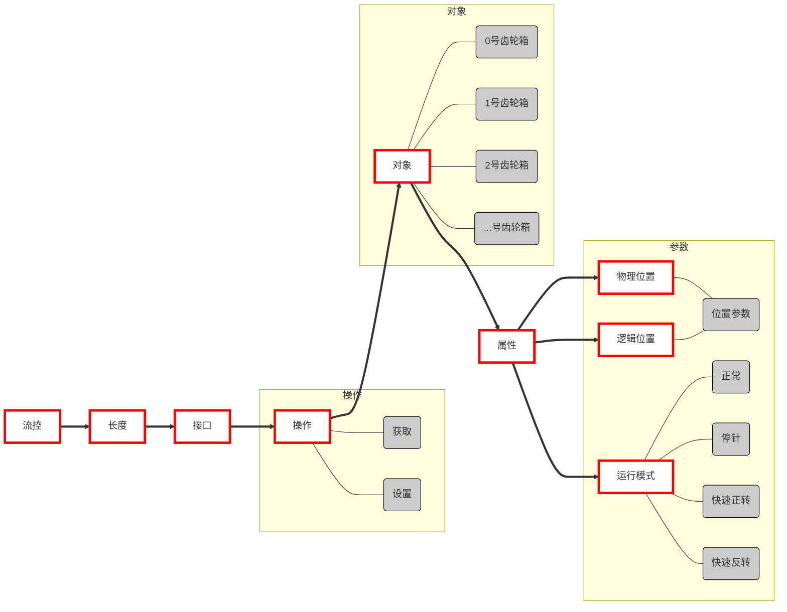

#  Corumi CSW系列机芯指针校准示例

CSW机芯支持两种指针校准方式
- 一种是指令式较准指针：通过组合指令控制所有指针指向12:00位置；
- 一种是位置式校准指针：通过输入手表指针停止时的物理位置并告诉手表；

> [!NOTE]
> 注意需要先获取手表识别码，再根据对应识别码发送相应参数。

## 协议解析说明
协议接口组成:  `fc` + `length` + `接口索引` + `操作数` + `参数{对象+属性+参数}`

| 流控 | 长度 | 接口 | 操作 | 对象 | 属性 | 参数 |
| ---- | ---- | ---- | ---- | ---- | ---- | ---- |
| fc | length | 指针控制[`0x02`] | 获取[`0x01`] | 齿轮箱编号[`0x00-0x02`] | 物理位置[`0x01`] | 位置参数 |
| | | | 设置[`0x02`] | | 逻辑位置[`0x02`] | 位置参数 |
| | | | | | 运行模式[`0x03`] | 正常[`0x00`] |
| | | | | | 运行模式[`0x03`] | 停针[`0x01`] |
| | | | | | 运行模式[`0x03`] | 快速正转[`0x02`] |
| | | | | | 运行模式[`0x03`] | 快速反转[`0x03`] |

- **length**：协议接口数据长度减去2（即不包含`fc` + `length` 2字节前缀）
- **调针接口索引**：`02`
- **调针设置操作数**：`02`
- **调针的参数**(对象)：先获取手表的识别码，例如手表识别码是`0x03`(两针半)，则`00`表示(大盘)，`01`表示(小盘)。大盘代表手表中间的时分秒区域，小盘代表手表的小指针。
- **调针的参数**(属性)：`01`(物理位置)、`02`(逻辑位置)、`03`(运行模式)。
- **调针的参数**(参数)：如属性设置为运行模式，则`00`(正常走针)、`01`(停针)、`02`(快速正转)、`03`(快速反转)、`04`(调整指针位置)。

## 位置式校准指针

基本步骤如下
1. 停针
2. 输入指针物理位置
3. 设置模式为正常走针模式

> [!TIP]
> 每个表盘的控制相互独立，需要分别控制停止和运行

### 例1

以下以识别到识别码为`0x03(同轴同步两针半)`为例

#### **大盘**

1. **停针**：`APP->:` `fc` `05` `02` `02` `00` `03` `01`

假如手表停针后指针指在`3:15`
2. **输入指针物理位置**：`APP->:` `fc` `06` `02` `02` `00` `01` `92` `04` 

通过协议文档中查询到识别码为`0x03`的大盘物理位置取值为12小时制秒数除以10。 
由此算出取值为：(3x3600+15x60)/10=1170。 将1170换算成16进制为0x0492，按高位在前的规则代入协议中的参数。

> [!NOTE|labelVisibility:hidden|iconVisibility:hidden]
> 此处物理位置的取值请参照协议文档“[**设备信息列表**](docs/classC/devices.md)”进行设置。

3. **正常走时**：`APP->:` `fc` `05` `02` `02` `00` `03` `00`

停针命令详解

| fc | 05 | 02 | 02 | 00 | 03 | 01 |
|:------:|:-------:|:-------:|:-------:|:-------:|:-------:|:-------:|
| **流控** | **长度** 5字节 | **命令** 指针控制 | **接口** 设置 | **对象** 0号齿轮箱 | **属性** 运行模式 | **参数** 停针 |

#### **小盘**

1. **停针**：`APP->:` `fc` `05` `02` `02` `01` `03` `01`
假如手表停针后小指针停在`46`秒位置为例
2. **输入指针物理位置**：`APP->:` `fc` `06` `02` `02` `01` `01` `2E` `00` （0x002E=46）
3. **正常走时**：`APP->:` `fc` `05` `02` `02` `01` `03` `00`

### 例2

以识别到手表识别码为`0x01(同轴同步三针半)`例
#### **大盘**

1. **停针**：`APP->:` `fc` `05` `02` `02` `00` `03` `01`

假如手表停针后指针指在`7:15:48`
2. **输入指针物理位置**：`APP->:` `fc` `06` `02` `02` `00` `01` `24` `66` 

通过协议文档中查询到识别码为0x01的大盘物理位置取值为`12`小时制秒数。 
由此算出取值为：7x3600+15x60+48=26148。 
将26148换算成16进制为0x6624。

> [!NOTE|labelVisibility:hidden|iconVisibility:hidden]
> 此处物理位置的取值请参照协议文档“[**设备信息列表**](docs/classC/devices.md)”进行设置。

3. **正常走时**：`APP->:` `fc` `05` `02` `02` `00` `03` `00`

#### **小盘**
1. **停针**：`APP->:` `fc` `05` `02` `02` `01` `03` `01`
假如手表停针后小指针停在`46`秒位置为例
2. **输入指针物理位置**：`APP->:` `fc` `06` `02` `02` `01` `01` `2E` `00` （0x002E=46）
3. **正常走时**：`APP->:` `fc` `05` `02` `02` `01` `03` `00`

## 步进式校准指针
基本步骤如下
1. 停针
2. 使用协议接口指令操作使得指针指向`12`点位置
3. 正常走针

以手表识别码为`0x08(同轴异步两针带屏)`为例
#### **分针**
1. **停针**：`APP->:` `fc` `05` `02` `02` `00` `03` `01`
2. **顺时针快转**：`APP->:` `fc` `05` `02` `02` `00` `03` `02`
3. **逆时针快转**：`APP->:` `fc` `05` `02` `02` `00` `03` `03`
4. **刻度调整模式**：`APP->:` `fc` `05` `02` `02` `00` `03` `04`

- **顺时针单步**：

1. `APP->:` `fc` `06` `02` `02` `00` `02` `01` `00`(设置逻辑位置为1)
2. `APP->:` `fc` `06` `02` `02` `00` `01` `00` `00`(设置物理位置为0)
3. `APP->:` `fc` `05` `02` `02` `00` `03` `04`

- **逆时针单步**：

1. `APP->:` `fc` `06` `02` `02` `00` `02` `00` `00`(设置逻辑位置为0)
2. `APP->:` `fc` `06` `02` `02` `00` `01` `01` `00`(设置物理位置为1)
3. `APP->:` `fc` `05` `02` `02` `00` `03` `04`

- **恢复正常步进**：`APP->:` `fc` `05` `02` `02` `00` `03` `00`

#### **时针**
分针的调针和分针一样，只是将”调针的参数(对象)”改为时针
