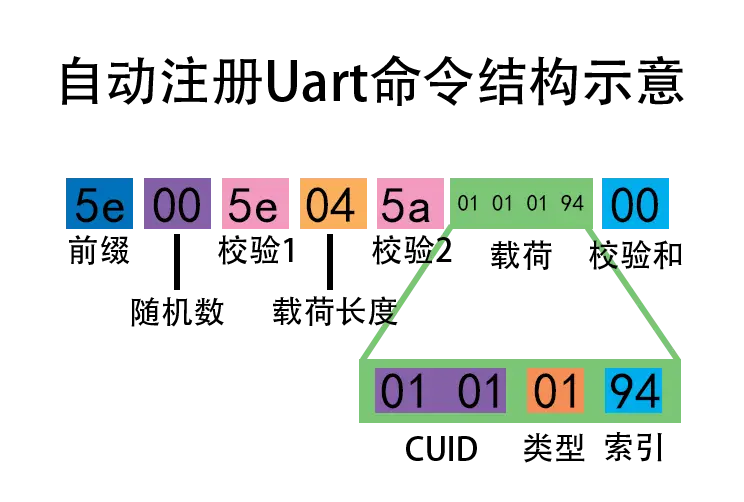

# ComiNode-GW-LP

本文档内容描述了与低功耗蓝牙5.0自组网网关模块`CN-GW-LP`通信的协议格式。

通信使用`uart:115200`接口。

## 序

协议框架如下：

协议载荷内容如下：

为简化描述，下述对指令内容的描述均只针对协议载荷部分，重复的前缀与后缀内容请参考上面的框架描述。

下表为协议载荷的结构：

| Bytes | 内容     | 备注                                                     |
| ----- | -------- | -------------------------------------------------------- |
| 5     | CUID0    | 16位循环唯一ID                                           |
| 6     | CUID1    | 通知消息会循环增加。返回和错误消息会与请求时的CUID一致。 |
| 7     | 类型     | 0x00:通知 0x01:控制 0xAA:返回 0xFF:错误         |
| 8     | 索引     |                                                          |
| 9~n   | 指令内容 |                                                          |

接下来将逐条描述每个协议索引的指令内容的结构。

由于每条协议都包括同样的如下结构，非载荷部分将在描述中省略。

~~`固定前缀`-`随机数`-`异或值1`-`载荷长度`-`异或值2`~~-**`载荷`**-~~`校验和`~~

> [!NOTE]
>
> - ACK
>
> 当载荷长度为`3`，且载荷只包含`CUID`与`0xAA`类型的数据包为`ACK`包。表示对于对应`CUID`数据包的确认。

## 指令列表

- `0xAA`|测试接口
- `0x90`|限时注册状态
  - 进入注册状态，连续1分钟未注册设备则超时退出
- `0x91`|枚举在网设备
  - 枚举已配网设备
- `0x92`|枚举自由设备
  - 枚举搜索到的未配网设备(mac)
- `0x93`|~~枚举所有设备~~
- `0x94`|注册设备
  - 自动注册设备
  - 指定mac地址注册
- `0x97`|唯一地址通信
  - 指定unicast地址发送消息
- `0x99`|移除设备
  - 从网络中移除指定设备

### 测试接口

模块使用一个`io`口作为测试输出。这个`io`口连接至板载LED指示灯。指示灯平常状态为1Hz闪烁。

**载荷定义如下：**

| 序号 | 内容 | 备注                   |
| ---- | ---- | ---------------------- |
| 5    | MM   | `CUID[0]`              |
| 6    | NN   | `CUID[1]`              |
| 7    | 0x01 | 控制                   |
| 8    | 0xAA | 0xAA=测试接口          |
| 9    | 0x55 | LED控制                |
| 10   | xx   | 0x00=关灯 0x01=开灯 |

指令`AA 55 01`将置`io`口为高（LED灭），并维持`5s`，uart协议层完整传输内容（当随机数取00时）为：

`5E 00 5E 06 58 00 00 01 AA 55 01 xx`

指令`AA 55 00`将置`io`口为低（LED亮），并维持`5s`。

### 限时注册状态

进入注册状态，超过1分钟则超时退出

| 备注     | 内容      |
| -------- | --------- |
| 类型     | 0x01      |
| 索引     | 0x90      |
| 指令内容 | `Reserve` |

### 退出注册状态

退出自动注册状态

| 备注     | 内容      |
| -------- | --------- |
| 类型     | 0x01      |
| 索引     | 0x93      |
| 指令内容 | `Reserve` |

### 枚举在网设备

返回在网设备列表

| 备注     | 内容      |
| -------- | --------- |
| 类型     | 0x01      |
| 索引     | 0x91      |
| 指令内容 | `Reserve` |

返回在网设备列表，每4个字节为一个设备，结构如下表所示

| 备注     | 长度     |
| -------- | -------- |
| unicast  | `2`bytes |
| 信号     | `1`byte  |
| 状态标志 | `1`byte  |

> 例：
> 
> 枚举在网设备: `5E 00 5E 04 5A 01 01 01 91 xx`  
> 
> 返回: `5E 3B 65 0C 69 01 01 AA 91 00 00 16 03 00 01 12 03 xx`  
> 这里返回了两个设备：  
> 第一个是`00 00 16 03`，表示地址是`0x0000`，相对信号强度是`0x16`  
> 第二个是`00 01 12 03`，表示地址是`0x0001`，相对信号强度是`0x12`

### 枚举自由设备

返回自由设备的大致数量

| 备注     | 内容      |
| -------- | --------- |
| 类型     | 0x01      |
| 索引     | 0x92      |
| 指令内容 | `Reserve` |

返回自由设备大致数量

### 注册设备

注册扫描到的首个自由设备

| 备注     | 内容 |
| -------- | ---- |
| 类型     | 0x01 |
| 索引     | 0x94 |
| 指令内容 | `/`  |

此命令根据长度可以通过MAC地址`指定注册设备`

即时返回`ACK`，成功后返回`返回码`，超时后返回`错误码`

为便于理解，图形化辅助表示如下：

### 唯一地址通信

| 备注     | 内容                                    |
| -------- | --------------------------------------- |
| 类型     | 0x01                                    |
| 索引     | 0x97                                    |
| 指令内容 | unicast地址(2bytes) 内容(1-200bytes) |

> 已定义的指令详细内容描述请参见低功耗节点协议文档

即时返回`ACK`

### 移除设备

| 备注     | 内容                |
| -------- | ------------------- |
| 类型     | 0x01                |
| 索引     | 0x99                |
| 指令内容 | unicast地址(2bytes) |

即时返回`ACK`，成功后返回`返回码`，超时后返回`错误码`
