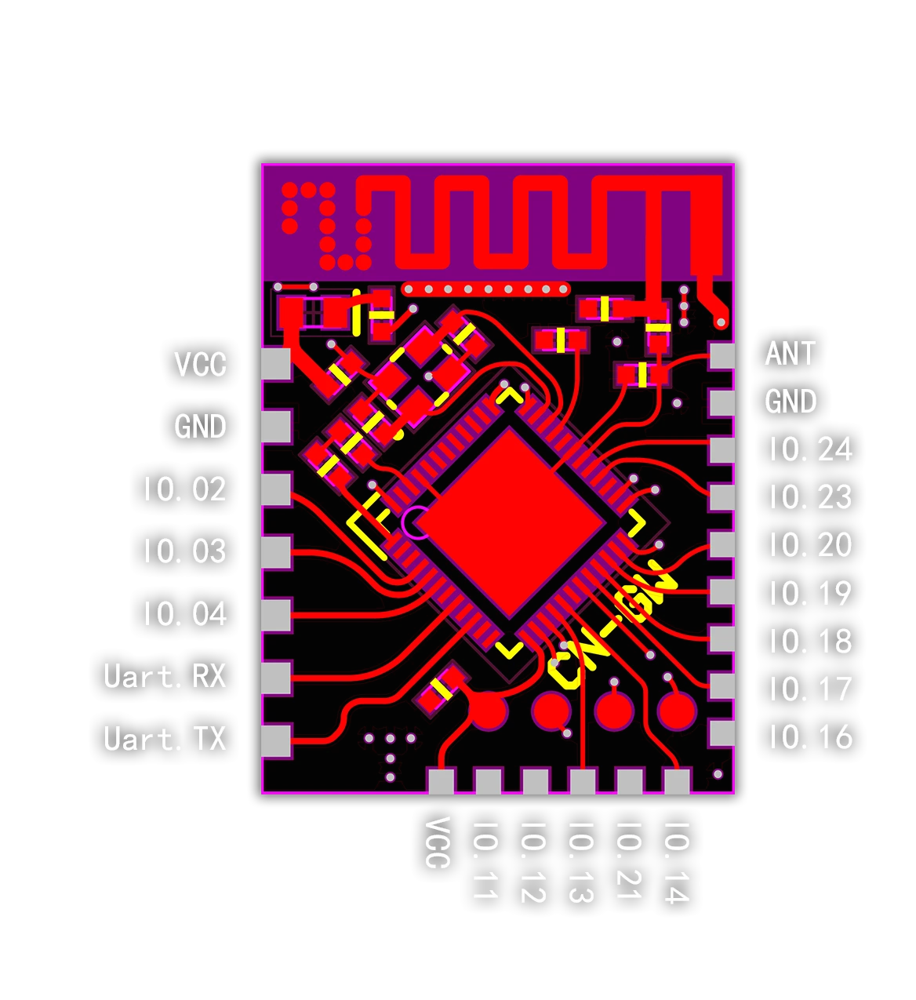
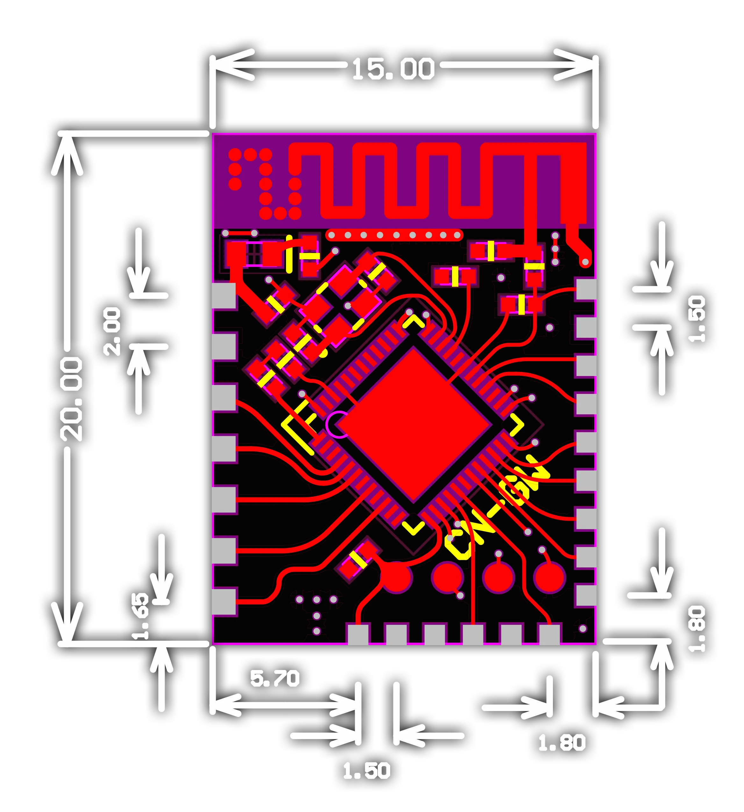

# 标准蓝牙Mesh组网模块接口

本文档内容描述了标准蓝牙Mesh组网模块的硬件接口。

- 目前模块包含一个可控制`IO`口用于测试。包含一组`UART:115200`接口用于调试通信协议。
  - 注：模块的`Uart.TX`表示模块的发送端口
- 除`Uart`接口外，其他的`IO`口均可自定义成其他功能，包括但不限于通信端口，如`IIC`、`SPI`等，或者`PWM`输出，电机等外设控制等。单个`IO口`最大输出`10mA`，所有`IO`口最大输出`20mA`

## 部署注意事项

- 模块部署安装时请注意天线部分上下方向不要紧贴金属部件，与之接触的`PCB`区域不要有铜箔覆盖，尽量保持净空或者直接悬空，以获得最佳的天线性能。
- 取掉连接板载天线的电阻便可以从`ANT`接口外接天线。

## 尺寸标注

### PCBA标注

