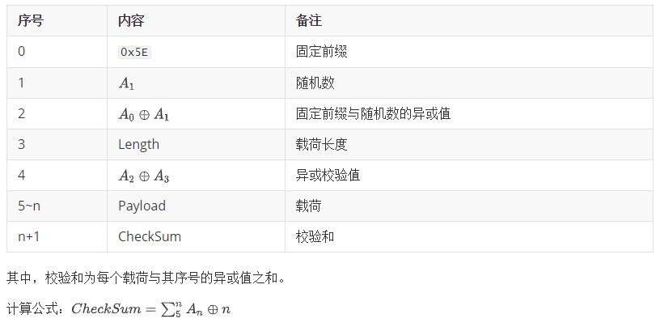

# ComiNode-TM-ULP

本文档内容描述了超低功耗蓝牙5.0自组网透传模块`CN-TM-ULP`通信的协议格式。

## 序

协议框架如下：

## 测试指令

模块使用一个`io`口作为测试输出。这个`io`口连接至板载LED指示灯。指示灯平常状态为1Hz闪烁。

指令`AA 55 01`将置`io`口为高（LED灭），并维持`5s`，uart协议层完整传输内容（当随机数取00时）为：

`5E 00 5E 06 58 00 00 01 AA 55 01 xx`

指令`AA 55 00`将置`io`口为低（LED亮），并维持`5s`。

## 通用接口(本地)

透传模块具备如下通用接口（括号内为其索引）：

- 心跳(`0x01`)
- 状态查询(`0x01`)
- 重置网络(`0xAF`)
- 数据上传(`0x71`)
- ACK

## 指令内容

为简化描述，下述对指令内容的描述均只针对协议载荷部分，重复的前缀与后缀内容请参考页面顶端的框架描述。

下表为协议载荷的结构：

| Bytes | 内容     | 备注                                                     |
| ----- | -------- | -------------------------------------------------------- |
| 5     | CUID0    | 16位循环唯一ID                                           |
| 6     | CUID1    | 通知消息会循环增加。返回和错误消息会与请求时的CUID一致。 |
| 7     | 类型     | 0x00:通知 0x01:控制 0xAA:返回 0xFF:错误         |
| 8     | 索引     |                                                          |
| 9~n   | 指令内容 |                                                          |

接下来将逐条描述每个协议索引的指令内容的结构。

由于每条协议都包括同样的如下结构，非载荷部分将在描述中省略。

~~`固定前缀`-`随机数`-`异或值1`-`载荷长度`-`异或值2`~~-**`载荷`**-~~`校验和`~~

> [!NOTE]
>
> - ACK
>
> 当载荷长度为`3`，且载荷只包含`CUID`与`0xAA`类型的数据包为`ACK`包。表示对于对应`CUID`数据包的确认。

### 心跳

心跳包包含模块本身的所有状态参数。在以下几种条件下会发送心跳包：

1. 模块上电时会主动发送一次心跳包
1. 收到查询状态指令时会发送一次心跳包
1. 连续`60s`未发生有效通信时会发送一次心跳包

当连续`3`次`心跳包#3`没有得到有效回复时，模块会拉低`timeout`引脚`1s`，可用于复位`MCU`

**载荷定义如下：**

| 序号 | 内容     | 备注                       |
| ---- | -------- | -------------------------- |
| 5    | MM       | `CUID[0]`                  |
| 6    | NN       | `CUID[1]`                  |
| 7    | 0x00     | 通知                       |
| 8    | 0x01     | 0x01=心跳包                |
| 9    | 配网状态 | 0x00=未配网 0x03=已配网 |
| ...  | 保留     |                            |

### 状态查询

强制获取一次心跳包

**载荷定义如下：**

| 序号 | 内容 | 备注          |
| ---- | ---- | ------------- |
| 5    | MM   | `CUID[0]`     |
| 6    | NN   | `CUID[1]`     |
| 7    | 0x01 | 控制          |
| 8    | 0x01 | 0x01=状态查询 |
| ...  | 保留 |               |

### 重置网络

删除模块保存的配网信息，使得模块恢复到未配网状态。

**载荷定义如下：**

| 序号 | 内容 | 备注             |
| ---- | ---- | ---------------- |
| 5    | MM   | `CUID[0]`        |
| 6    | NN   | `CUID[1]`        |
| 7    | 0x01 | 控制             |
| 8    | 0xAF | 0xAF=重置网络    |
| 9    | 0x77 | 重置网络固定后缀 |
| 10   | 0xEE | 重置网络固定后缀 |
| 11   | 0xFF | 重置网络固定后缀 |
| 12   | 0x00 | 重置网络固定后缀 |

### 数据上传

将数据透传给网关。如未配网，则会返回错误。

**载荷定义如下：**

| 序号 | 内容    | 备注          |
| ---- | ------- | ------------- |
| 5    | MM      | `CUID[0]`     |
| 6    | NN      | `CUID[1]`     |
| 7    | 0x01    | 控制          |
| 8    | 0x71    | 0x71=数据上传 |
| 9~n  | xxxxxxx | 透传数据      |

