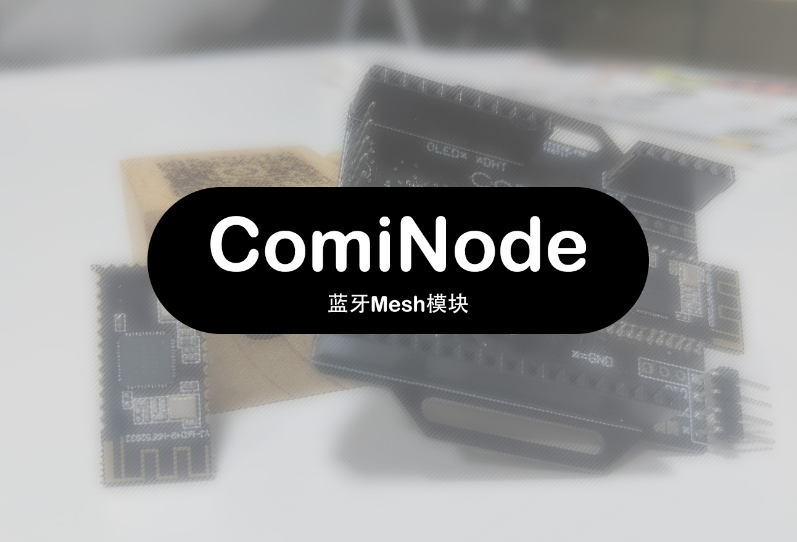

# ComiNode 蓝牙Mesh模块

本文档内容描述了蓝牙Mesh模块`ComiNode`的硬件接口与通信协议相关内容。

> [!WARNING]
> 本模块处于开发状态，其中的内容可能随时变更，文档更新存在滞后，内容可能并非最新

## 类型

目前规划具有多种类型模块，描述如下

- 通用传输模块
  1. 网关模块*(ComiNode-GW)*
  1. 透传模块*(ComiNode-TM)*
- 功能模块
  1. 低功耗*(ComiNode-LP)*
  1. 物理输入*(ComiNode-IN)*
  1. LED灯控
  1. etc..

## 接口

模块具有多种接口，与第三方设备通信主要使用`UART-115200`接口进行。

协议框架如下：

---

*以下为文档渲染兼容性原因的原文备份内容。*

---

## Backup

由于`latex`解析兼容性原因，将包含`latex`的文档原文备份如下。

| 序号 | 内容             | 备注                     |
| :--- | :--------------- | :----------------------- |
| 0    | `0x5E`           | 固定前缀                 |
| 1    | $A_1$            | 随机数                   |
| 2    | $A_0\oplus A_1$  | 固定前缀与随机数的异或值 |
| 3    | Length           | 载荷长度                 |
| 4    | $A_2 \oplus A_3$ | 异或校验值               |
| 5~n  | Payload          | 载荷                     |
| n+1  | CheckSum         | 校验和                   |

其中，校验和为每个载荷与其序号的异或值之和。

计算公式：$$ CheckSum = \sum_5^n A_n \oplus n $$