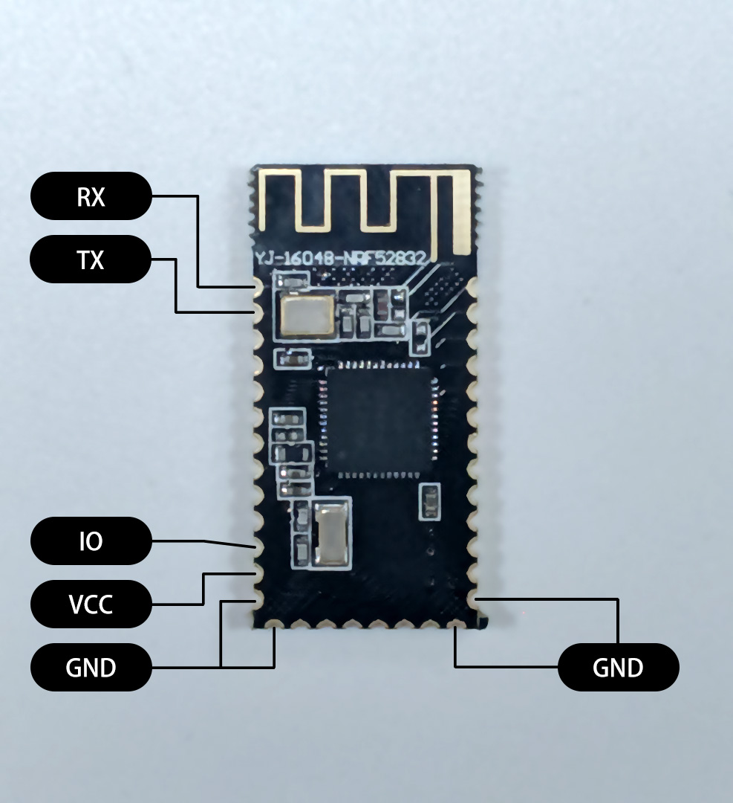
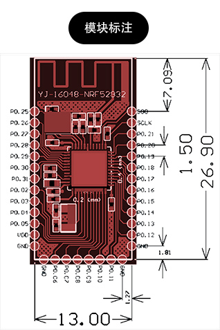
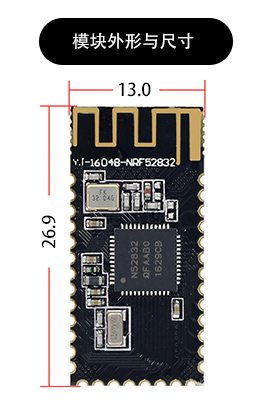

# ComiNode 模块接口

本文档内容描述了蓝牙Mesh模块`ComiNode`的硬件接口。

- 目前模块包含一个可控制`IO`口用于测试。包含一组`UART:115200`接口用于调试通信协议。
- 目前模块预先进行了配网。拿到的模块上电均会自动入网。通过`UART`发送的数据会广播透传到每一个网络中的节点。
- 后续将逐步添加配网、分组、桥接等网络功能，和更多可控制逻辑与`PWM`等高级`IO`功能。

## 尺寸标注

### PCBA标注

### 模块标注

