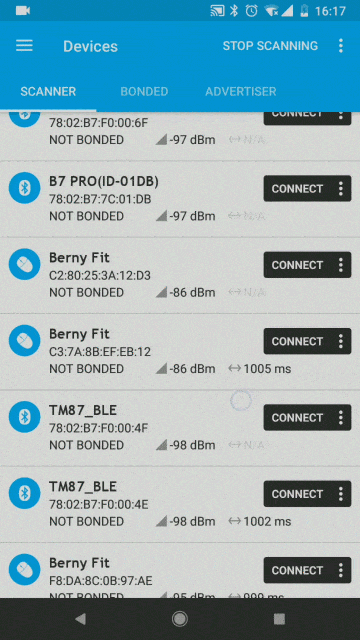

============
DFU升级
============

.. note::

    本文档用于说明如何使用第三方软件对搭载了 ``nordic`` 芯片的设备进行固件更新。

使用安卓进行DFU空中升级
=============================================

在进行DFU升级之前，请先确认在手机中已经准备好 ``zip`` 格式的升级包。(注意，请不要将压缩包解压)

0. 下载并安装 ``nrf connect`` 软件
--------------------------------------

- 软件可通过谷歌官方 `[Google Play下载] <https://play.google.com/store/apps/details?id=no.nordicsemi.android.mcp>`_ 下载
- 无法访问谷歌商店的用户可以使用 `[Github下载] <https://github.com/corumi-os/opendoc/releases/download/apk/no.nordicsemi.android.mcp.apk>`_
- 请不要在大陆安卓商店下载，因其上版本大多已经过期，无法正常使用。请使用 ``4.19.2`` 之后的版本

1. 打开软件，搜索设备
--------------------------------------

.. image:: ./pic/GIF1.gif

- 首先，点击软件图标，打开软件
- 如果出现没有打开蓝牙的提示，点击 ``enable`` 自动打开蓝牙
- 点击 ``scan`` 按钮，或者在界面中下拉，开始搜索设备
- 找到自己的设备

2. 连接设备
--------------------------------------

- 点击 ``connect`` 连接设备

3. 点击DFU按钮，并选择升级包
--------------------------------------

.. image:: ./pic/GIF3.gif

- 点击右上角的`DFU`按钮
- 选择已经准备好的升级包（不能正常选择的用户，可尝试长按安装包选择）

4. 等待升级完成
--------------------------------------

.. image:: ./pic/GIF4.gif

- 根据系统的不同，升级进度会显示在通知栏，或者如图中所示的另一个 ``tab`` 中
- 点击原设备名的 ``tab`` 可显示升级进度

5. 断开连接，退出软件
--------------------------------------

.. image:: ./pic/GIF5.gif

- 点击 ``disconnect`` 断开连接
- 点击 ``x`` 关闭打开的 ``tab``
- 然后退出软件
- 之后就可以正常的使用客户端 ``app`` 来连接设备了

